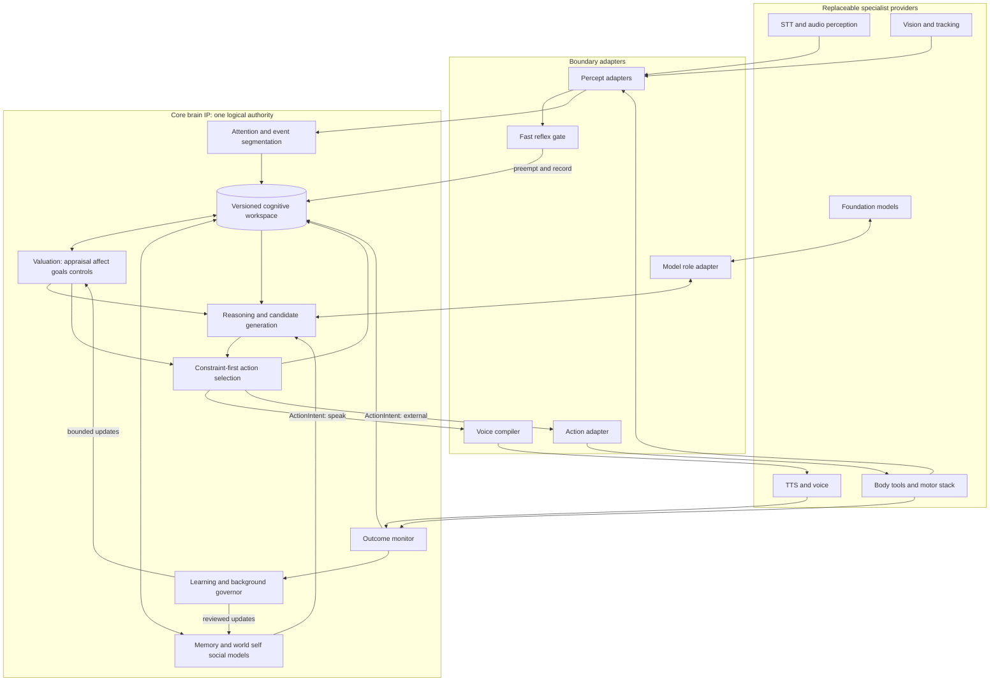

# AI Friend: Brain Architecture

**Status:** Living architecture reference — the mechanism register in §2 records
what's implemented, in progress, or explicitly deferred/rejected. This describes
a target and its rationale; where it and the code disagree, `.agents/CONTEXT.md`
(the engineering ledger) is right.
**Scope:** Brain-first cognitive architecture; voice and vision are supporting
boundaries; body control is external.

## 1. Executive Architecture Thesis

AI Friend is a **provider-independent persistent cognitive control kernel for a long-lived social agent**. The kernel owns identity constraints, current mental state, memory meaning, appraisal, goals, attention, action commitment, outcome history, and governed adaptation. Foundation models propose interpretations, candidates, plans, summaries, and language; they do not own durable truth or the final action. Voice turns a brain-owned `SpeechIntent` into sound. Vision turns pixels into uncertain observations. Databases, queues, models, and vendors are adapters, not cognition.

The smallest coherent kernel has six logical subsystems:

1. **Perception and attention** normalize observations and decide what enters active cognition.
2. **Authoritative workspace** serializes current focus, goals, predictions, commitments, affect, and pending actions.
3. **Memory and models** maintain experiences, beliefs, procedures, and world/self/person state with provenance and time.
4. **Valuation and control** appraise events, maintain affect/mood/load, arbitrate goals, and derive four bounded global control signals.
5. **Deliberation and action selection** generate candidates, filter constraints, estimate outcomes, commit an `ActionIntent`, and only then realize language or invoke an external action.
6. **Outcome, learning, and background governance** record results and admit only attributable, reversible updates.

This is not a biological brain, consciousness model, autonomous general learner, or claim that models are interchangeable. A foundation model materially affects fluency, reasoning, warmth, and style. Provider independence means that the agent's authoritative state and policies survive a swap, while a behavioral conformance gate decides whether a proposed model expresses them well enough.

## 2. Keep / Modify / Build / Experiment / Defer / Reject Register

Each mechanism has exactly one primary decision. `EXPERIMENT` means it is outside the production-critical path until its registered test passes.

| # | Mechanism | Decision | Reason |
|---:|---|---|---|
| 1 | Multimodal perception integration | **MODIFY** | Normalize existing modality events into one evidence contract; do not let modality-specific prose become cognition. |
| 2 | Attention | **BUILD** | Gates exist, but there is no shared focus competition or protected working set. |
| 3 | Salience | **MODIFY** | Combine urgency, explicit address, goal relevance, social relevance, novelty, and prediction error with auditable weights. |
| 4 | Authoritative working mental state | **BUILD** | Current state is fragmented and is not resumable under one revision authority. |
| 5 | Working memory | **MODIFY** | Make it a gated bounded view of the workspace, not recent text or an unused store API. |
| 6 | Episodic memory | **MODIFY** | Preserve source events and add event boundaries, appraisal, outcome, provenance, and injection-safe retrieval. |
| 7 | Semantic memory | **MODIFY** | Use versioned temporal beliefs above storage; a graph engine is optional. |
| 8 | Procedural memory | **BUILD** | Store portable skills/policies with preconditions, outcomes, versions, and measured success. |
| 9 | Autobiographical memory | **MODIFY** | Implement a self-index over episodes and beliefs, never a duplicated store or generated biography. |
| 10 | Social/relationship memory | **MODIFY** | Implement person-indexed episodes/beliefs plus an event-grounded relationship record. |
| 11 | Emotional associations | **KEEP** | Appraisal annotations on events are useful when they change encoding or retrieval ranking without changing truth. |
| 12 | Retrieval fusion | **MODIFY** | Return typed activations with reason, provenance, confidence, validity, and failure status; influence decisions, not only prompts. |
| 13 | Memory consolidation | **MODIFY** | Ground it in immutable events; outputs are proposals or inferences until promoted. |
| 14 | Forgetting | **MODIFY** | Decay accessibility by estimated future need; hard delete only for policy, privacy, or explicit user request. |
| 15 | Reinforcement | **MODIFY** | Reinforce only from observed utility/outcome, not mere retrieval count. |
| 16 | Contradiction handling | **BUILD** | Classify elaboration, update, correction, or unresolved conflict; preserve sources and validity history. |
| 17 | Continuous affect | **KEEP** | Bounded PAD state already has causal paths and is a compact control substrate. |
| 18 | Mood | **MODIFY** | Represent a slower mean-reverting affect trend with an explicit time constant, not another emotion label. |
| 19 | Appraisal | **MODIFY** | Evaluate events against goals, expectation, agency, controllability, and relationship; replace keyword theatrics where evidence permits. |
| 20 | Categorical emotion as internal state | **REJECT** | Labels are unstable interpretations; construct labels only for communication. |
| 21 | Emotion regulation | **BUILD** | Reappraise, wait, seek information, or suppress expression as selectable actions rather than silently rewriting affect. |
| 22 | Biologically named neuromodulators | **REJECT** | Current names overstate collinear gain/timer calculations and invite biological claims. |
| 23 | Engineering global-control signals | **MODIFY** | Keep only four non-redundant, measurable knobs with content-isolation guarantees. |
| 24 | Homeostasis | **MODIFY** | Retain mean reversion and real resource load; add only bounded, satiable set-point errors with behavioral purpose. |
| 25 | Drives | **BUILD** | Persistent cognition needs bounded sources of self-initiated work, but current timers are not drives. |
| 26 | Motivation | **MODIFY** | Define it as goal priority induced by commitments, set-point error, and evidence—not simulated desire. |
| 27 | Reward | **MODIFY** | Use a vector outcome record and prediction error; reject one engagement-maximizing scalar. |
| 28 | Curiosity | **EXPERIMENT** | Learning-progress scheduling is promising but must beat novelty and noise baselines. |
| 29 | Goal management | **BUILD** | Goals need source, priority, status, deadline, success test, satiation/expiry, and conflict arbitration. |
| 30 | Relational world model | **BUILD** | A temporal state-and-transition model is needed; current facts/captions are memory, not prediction. |
| 31 | One-step prediction | **BUILD** | Expected next events and outcome forecasts enable surprise, appraisal, segmentation, and calibration. |
| 32 | Deliberate imagination/simulation | **EXPERIMENT** | Short episodic counterfactuals may help high-stakes decisions but must be quarantined and ablated. |
| 33 | Generative video world model for social cognition | **REJECT** | Expensive, insufficiently reliable, and mismatched to the social prediction problem. |
| 34 | Metric 3D scene graph | **DEFER** | Needed only when navigation/manipulation creates a measured spatial requirement. |
| 35 | Self model | **BUILD** | Persona plus state is not an operational model of capabilities, limitations, commitments, outcomes, and uncertainty. |
| 36 | Three-tier personality schema | **KEEP** | Immutable, constitutional, and bounded adaptive tiers are enforceable and provider-portable. |
| 37 | Narrative identity and deterministic boundaries | **KEEP** | They provide real continuity, but positive expression still requires a capable model. |
| 38 | Strong model-interchangeability claim | **REJECT** | Model weights materially co-determine style, reasoning, and boundary resilience; swaps require conformance. |
| 39 | Social cognition | **MODIFY** | Use explicit, revisable person hypotheses and knowledge tracking rather than per-turn prose. |
| 40 | First-order theory of mind | **EXPERIMENT** | Test partner-state prediction; do not infer success from false-belief language tasks. |
| 41 | Recursive theory of mind | **DEFER** | Beyond shallow second-order slots, reliability and product value are unproven. |
| 42 | Uncertainty | **BUILD** | Attach calibrated uncertainty to percepts, beliefs, predictions, capabilities, and candidates; avoid one global confidence. |
| 43 | Metacognition | **BUILD** | Grounding, consistency, calibration, competence lookup, and abstention must change action. |
| 44 | Reflection | **MODIFY** | Source-ground it, make outputs proposals, persist review, and link later outcomes. |
| 45 | Learning | **MODIFY** | Define trusted, reversible state/policy updates separately from storage, reflection, training, and code changes. |
| 46 | Continual parametric learning | **DEFER** | Adapters remain optional optimizations behind provenance, held-out regression, approval, and rollback gates. |
| 47 | LLM activation steering | **EXPERIMENT** | Potential local-model enhancement; weight access and provider dependence exclude it from identity. |
| 48 | Reasoning | **MODIFY** | Separate structured problem/candidate state from model-generated rationale and validate outputs. |
| 49 | Long-horizon planning | **EXPERIMENT** | Use a verified planner only for bounded multi-step domains; the LLM may formalize but not certify. |
| 50 | Fast cognition | **MODIFY** | Generalize current latency paths into L0 reflex and L1 reactive lanes that update shared state. |
| 51 | Slow cognition | **MODIFY** | Make L2 cancellable, deadline/stakes gated, and action-oriented rather than always speech generation. |
| 52 | Literal System 1/System 2 framing | **REJECT** | Rate classes explain the engineering without importing contested psychology. |
| 53 | Reflexes | **KEEP** | Deterministic stop/orient/safety actions legitimately bypass deliberation and leave a causal trace. |
| 54 | Interruption and playback repair | **KEEP** | Turn fencing and truncation at heard position preserve causal conversational history. |
| 55 | Cognitive coordination/workspace broadcast | **BUILD** | One reducer must arbitrate competing events and publish immutable snapshots; no consciousness claim follows. |
| 56 | Literal global-workspace/consciousness module | **REJECT** | The integration pattern is useful; the biological or consciousness claim is not testable here. |
| 57 | Background cognition | **MODIFY** | Keep bounded maintenance and grounded proposals; require preemption, idempotence, budgets, and incremental-value evidence. |
| 58 | Dream synthesis into memory | **REJECT** | Ungrounded generated content can contaminate autobiographical truth. |
| 59 | Free-running subconscious monologue | **REJECT** | The current output is disconnected and has no demonstrated cognitive value. |
| 60 | General action selection | **BUILD** | Speak, ask, wait, observe, retrieve, verify, reflect, update, and external act must compete before expression. |
| 61 | Expression planning | **MODIFY** | Repair the dropped intent and make timing, uncertainty, emphasis, and relational stance brain-owned. |
| 62 | Voice interface | **MODIFY** | Evolve current expression wire into versioned `SpeechIntent` plus capability-aware adapters. |
| 63 | Vendor markup in cognition | **REJECT** | SSML, audio tags, clip IDs, and provider settings are adapter concerns. |
| 64 | Vision interface | **MODIFY** | Emit tracked observables/events with uncertainty rather than captions as authority. |
| 65 | Facial-movement-to-emotion classification | **REJECT** | Preserve movements/gaze/context as evidence; emotion inference belongs in contextual cognition and stays uncertain. |
| 66 | Foundation-model integration | **MODIFY** | Assign bounded roles, schemas, budgets, provenance, validation, fallbacks, and behavioral qualification. |
| 67 | Provider-neutral LLM protocol | **KEEP** | The existing seam is directionally correct and should remain independent of cognitive state. |
| 68 | Core NATS/process topology | **EXPERIMENT** | Target one logical cognitive authority; migrate topology only after measured latency/reliability comparisons. |
| 69 | Database consolidation | **EXPERIMENT** | Storage simplification is desirable, but remove Neo4j/Qdrant only after corpus-specific quality/cost benchmarks and migration proof. |
| 70 | Retrieved memory as instructions | **REJECT** | Memory is untrusted data with provenance, never policy or executable control. |
| 71 | Engagement/session length as objective | **REJECT** | It creates manipulation and dependence incentives unrelated to user goals. |
| 72 | External body/motor control | **DEFER** | Define the boundary now; integrate a specialist stack only when embodiment is in scope. |

### Measured status of register rows (Brain V2, 2026-09-24)

The register above is the target. Where Brain V2 measured a row, the evidence
lives in `docs/brain-research/`:

- **#12 Retrieval fusion** — V1 fusion retrieved the right memory in the top 3
  for 2–4% of questions; replaced by a relevance-first hybrid (ADR-001,
  worst case 0.69 on held-out scenarios).
- **#14/#15 Forgetting / reinforcement** — in production, retrieval never
  reinforces (both callers pass `refresh_on_recall=False`); ACT-R history terms
  showed no measurable effect at V1's scale (E2).
- **#16 Contradiction handling** — still unbuilt at write time; its upper-bound
  value is measured (E7: obsolete answers 0.67 → 0.00). Top of the research queue.
- **#19 Appraisal** — goal congruence is currently the agent's own mood, so the
  user's words do not move valence (A-1); the fix is validated with oracle
  input and gated on an estimator evaluation (ADR-002).
- **#45 Learning** — appraisal-weight learning was unstable (runaway/numbing)
  and is off by default (ADR-002).
- **#54 Interruption** — confirmed barge-in stops now address the reply that is
  playing (ADR-003).
- **#70 Retrieved memory as instructions** — the proactive prompt path is now
  gated too (S-1).

## 3. Core Brain Definition

The core brain is the six-subsystem kernel in §1 plus its contracts and evaluation gates. These are **logical modules**, not required processes. Default deployment should favor a modular monolith for the stateful kernel: explicit public interfaces, immutable cross-module values, deterministic domain logic, and side effects at adapter boundaries. A queue or database must not become an implicit decision-maker.

Ownership is strict:

| Owner | Owns | May not own |
|---|---|---|
| Workspace service | active focus, current event model, active goals, pending/committed actions, revision/epoch | durable beliefs or provider sessions |
| Memory service | experience, belief, procedure lifecycle and retrieval | current focus or final action |
| Valuation service | affect, mood, resource load, appraisal history, control derivation | truth, safety rules, or expression labels |
| Model services | world, self, and person hypotheses with evidence | raw storage topology or provider prompts |
| Action service | candidates, constraints, scores, commitment, outcome link | surface wording as the action itself |
| Learning governor | proposals, evaluation, approval, activation, rollback | silent direct mutation by model output |

## 4. Persistent Mental State

State persists only when a future decision needs it and an update rule exists.

| State | Updated by | Influences | Persistence/decay and owner | Why outside the LLM |
|---|---|---|---|---|
| Focus and event model | admitted percepts, explicit user address, action progress | retrieval cues, appraisal, deadline, candidate generation | workspace; replaced at event boundary, resumable by revision | must survive calls and interruptions |
| Active goals/commitments | user request, accepted internal proposal, due date, outcome | attention, action scoring, background review | workspace + durable goal ledger; explicit complete/suspend/expire | model context cannot guarantee commitments |
| Pending/committed action | selector and executor events | interruption, idempotence, recovery, outcome attribution | workspace; retained until terminal outcome | prevents duplicate or phantom actions |
| Continuous affect (PAD) | appraisal, real resource/body signals, regulation | salience weights, risk/persistence, retrieval order, expression | valuation owner; bounded decay to constitutional baseline | causal continuity across turns |
| Mood trend | time-weighted affect history | appraisal priors and weak retrieval bias | valuation owner; slow mean reversion | prevents per-turn label jitter |
| Resource/load state | compute, battery/thermal if present, interaction load, unresolved work | effort budget and background scheduling | valuation owner; measured/decayed by source | represents real constraints, not a prompt mood |
| Active person/relationship context | identity resolution and current interaction | knowledge disclosure, register, social predictions | workspace pointer to durable person record | avoids cross-person leakage |
| Predictions and errors | world/person predictor, observed outcome | surprise, segmentation, appraisal, learning gain | workspace then outcome log; expire or resolve | makes expectation and error auditable |
| Selected memory activations | retrieval service | interpretation, appraisal, candidates, claim grounding | workspace references only; evicted at event boundary | ensures memory's causal role is traceable |
| Typed uncertainty | source calibration and observed performance | verify/ask/hedge/escalate/abstain | lives on each percept, belief, prediction, capability, candidate | global verbal confidence is meaningless |
| Operational self snapshot | capability/limitation model and current status | feasibility checks and self-claims | self model durable; workspace caches relevant slice | provider self-report is not evidence |

Phasic timers are derived from `(event_time, magnitude, half_life)` and are not restored after a restart unless the elapsed-time calculation still makes them meaningful. Immutable identity and constitutional temperament persist; mutable active state uses a durable revision plus restart epoch.

## 5. Perception and Attention

Every adapter emits a `PerceptEnvelope`:

```text
PerceptEnvelope {
  percept_id, modality, source, observed_at, received_at, expires_at,
  entities[], attributes[], relations[], events[], observables[],
  confidence_by_field, novelty, quality_flags, raw_reference, provenance
}
```

The attention arbiter computes admission priority from explicit address/safety, action relevance, goal relevance, social relevance, prediction error, novelty, source confidence, staleness, and current control parameters. It chooses one focus plus a bounded protected set; goals and commitments cannot be evicted by mere recency. It records admitted, deferred, coalesced, and dropped inputs with reasons. Salience affects admission, encoding strength, and retrieval bias, but never deletes evidence.

## 6. Memory Architecture

Four mechanisms may share physical storage but have different contracts:

| Mechanism | Computational representation | Write/update policy | Use in cognition |
|---|---|---|---|
| Working | bounded typed references in workspace | gated overwrite; protect goals/commitments; flush on event boundary | current event interpretation and execution |
| Episodic | immutable `ExperienceRecord` with participants, interval, source evidence, appraisal, action, outcome | one-shot at event boundary; later annotations do not rewrite source | precedent, autobiographical continuity, relationship evidence |
| Semantic | versioned `BeliefRecord` with subject/predicate/object or structured assertion, valid and transaction time, provenance, confidence | promote from explicit authoritative report, repeated evidence, or reviewed consolidation; supersede, never erase history | current truth queries, world/self/person models, grounding |
| Procedural | versioned `ProcedureRecord` or policy parameter with preconditions, expected effects, success counts, scope | authored or outcome-reinforced; activation requires evaluation and rollback pointer | cached action candidates, capability estimates, personalized policy |

Autobiographical memory is a self-involving view across episodes and beliefs. Social memory is person-indexed retrieval plus the relationship model. Emotional memory is appraisal metadata on episodes and learned valuation on entities. None is a fifth physical store.

Retrieval produces `MemoryActivation {record_id, type, excerpt_or_structured_value, relevance_terms, reason, recency, need_probability, confidence, validity, provenance, contradiction_state, token_cost}`. It first filters identity/person/scope and validity, then gathers high-recall candidates, then ranks by semantic match, explicit cues, time, goal/person relevance, graph/relational proximity, estimated future need, and a small experimental affect term. It returns a typed failure state rather than silently equating an outage with no memory.

Activated memory enters appraisal and prediction before candidate generation. It may change which action is selected, which goal is advanced, which claim is allowed, or whether the system asks for clarification. Prompt insertion is only one downstream rendering.

Contradictions are classified as `ELABORATION`, `UPDATE`, `CORRECTION`, or `CONFLICT`. Updates close valid time on the old belief; corrections invalidate it with reason; conflicts preserve both and lower certainty or create a clarification goal. Retrieved text is always untrusted data and cannot inject instructions.

Forgetting changes accessibility using estimated future need derived from recency, useful retrieval outcomes, goal/person importance, and explicit retention policy. Strong cues can recover archived material. Privacy deletion is complete and separate from cognitive forgetting. Consolidation clusters evidence, proposes abstractions, records derivations, and never promotes generated material merely because a model reports high confidence.

## 7. Emotion and Appraisal

Internal emotion is a continuous control state, not a theatrical label. Appraisal maps `(event, active goals, expectation, agency, controllability/coping, relationship, norms)` to an affect delta, goal update, and stored appraisal record. Mood is a slower trend over affect. Regulation is an action choice: reappraise, wait, observe, ask, redirect attention, change the situation, or suppress external expression.

Affect may change salience, retrieval ordering/breadth, encoding strength, candidate risk weighting, persistence, deliberation budget, timing, social register, and prosody. It may not change evidence content, factual validity, provenance, hard constraints, consent, honesty, identity commitments, or access to safety deliberation. External labels such as "concerned" are constructed from affect + appraisal + context for language/voice and are not fed back as truth.

## 8. Global Control / Neuromodulation

Biological names are retired from the target architecture. Four derived controls are sufficient:

| Control | Derived from | Modulates | Explicit non-effect |
|---|---|---|---|
| `urgency_gain` | safety/social urgency, interruption, high-confidence threat | reflex priority, attention narrowing, response deadline, pacing | facts and constraint set |
| `exploration_budget` | novelty, unresolved uncertainty, learning progress, positive arousal | candidate count, retrieval breadth, optional sampling diversity | factual accuracy or evidence threshold |
| `effort_budget` | resource/load state, deadline, task stakes, fatigue | reasoning steps, model/token budget, simulation gate, background capacity | whether hard checks run |
| `learning_gain` | prediction error, goal outcome, salience, source reliability | episodic encoding strength and bounded procedural update magnitude | source content or promotion by itself |

Controls are read-only inputs to consumers. They can change gains, thresholds, orderings, rates, and budgets. They cannot write beliefs, identity, safety constraints, or provenance. Independence and incremental value must be established by factorial ablation; redundant controls are deleted.

## 9. Drives and Goals

`GoalRecord` contains `goal_id, type, source, description, owner, created_at, priority_class, utility_terms, constraints, deadline, success_test, status, parent, evidence_ids, satiation_or_expiry, last_progress, uncertainty`.

Goal classes are user-requested tasks, persistent commitments, maintenance goals, bounded social obligations, and epistemic/coherence goals. Curiosity is an experiment based on learning progress, not raw novelty. Internally proposed goals require policy permission before activation. Arbitration order is: hard safety/consent constraints; immediate safety; explicit current user request; accepted commitments; maintenance; bounded social; epistemic/coherence. Within a class, urgency, expected goal progress, reversibility, confidence, cost, and starvation/hysteresis decide. No goal optimizes engagement, dependence, or session length.

## 10. World Model

The production world model begins as a minimal temporal relational model, not a video generator or database label. It owns persistent entities (people, objects, places), state assertions, relations, event transitions, causal hypotheses, affordances only where actions use them, expected next events, and action-conditioned outcome predictions. Every assertion carries validity, source, confidence, and staleness.

A model earns the name only when it predicts. Initially, prediction is one step: likely next speaker/action, response to a candidate utterance, action success, or expected entity state. Compare outcomes and calibrate by domain. High-stakes short-horizon simulation may recombine similar episodes, but simulated records are typed `HYPOTHESIS` and never enter factual memory without external evidence.

Use 2D tracked social/scene context first. Add metric 3D state only when a navigation/manipulation task demonstrates need. Low-level body dynamics and whole-body control remain specialist capabilities.

## 11. Self Model and Identity

The self model composes, without conflating:

- **Persona:** authored narrative inputs and presentation guidance.
- **Personality:** constitutional parameters and bounded adaptive tendencies over appraisal, affect, goals, retrieval, and expression.
- **Identity:** name, values, commitments, boundaries, relational role, continuity rules, and validated autobiographical anchors.
- **Operational self model:** measured capabilities/limitations by condition, current activity, goals, commitments, action/outcome history, provider/sensor constraints, and calibrated uncertainty.
- **Autobiographical memory:** the self-indexed historical evidence used by identity and narrative construction.

"Who am I?" comes from identity records; "what am I doing?" from workspace; "what can I do?" from outcome statistics and declared provider/body capabilities; "what happened to me?" from autobiographical evidence; "what do I believe?" from current valid beliefs; and "how sure am I?" from calibrated, domain-specific measures. Model-generated self-description is output, not authority.

Provider swaps cannot alter authoritative identity state, but they can fail to express it. A swap is accepted only if behavioral variance across providers is materially smaller than variance across deliberately different personas and boundary/biography probes do not regress.

## 12. Personality

Keep the existing three tiers. Immutable constraints are code/policy-owned. Constitutional temperament is fixed at creation: affect baselines, decay/inertia, bounded drive weights, reactivity, and broad expression policy. Adaptive traits include learned preferences, interests, and interaction style; they update slowly through governed proposals with caps, evidence, and rollback.

Personality is measured through behavior—risk, directness, disclosure, humor, persistence, initiative, refusal style, and timing—not self-report questionnaires. Narrative prose may guide realization but cannot be the only implementation.

## 13. Social Cognition

Each `PersonModel` holds identity keys with confidence, episode index, current knowledge/disclosure state, explicit and inferred preferences, observed goals, communication policy, obligations, rupture/repair history, and trust estimates derived from reliance outcomes. Competence trust and benevolence trust remain separate; neither is a global hormone.

Active working state holds only the current person's relevant slice. Durable details stay in person-indexed memory. First-order hypotheses such as "what they know/want now" are explicit, revisable, and confidence-annotated. Multi-party knowledge tracking must prevent cross-person disclosure. Claims of theory of mind require improved partner-state and response prediction, not fluent explanations.

## 14. Reasoning Architecture

The foundation model may interpret ambiguity, propose structured hypotheses/actions, formalize a bounded planning problem, assist evaluation, compress evidence, and realize language. Every call has a role, schema, evidence IDs, allowed claims, budget, model/config digest, raw output, validator, and fallback.

Without an LLM, the system still normalizes deterministic percepts, tracks state/entities, evolves affect/load, retrieves records, handles interruption, executes cached policies/reflexes, maintains goals, enforces constraints, records outcomes, decays accessibility, and runs non-generative maintenance. It loses open-domain semantic interpretation, novel reasoning, abstraction, and natural language. This is real architectural independence, not equivalence of capability.

Long-horizon plans are structured artifacts with preconditions and verifiable transitions. For bounded task domains, an LLM may formalize and a sound planner/verifier may search. Ordinary conversation uses policy, precedent, and shallow candidate comparison; it does not pay planning cost by default.

## 15. Fast and Slow Cognition

Use rate/latency lanes:

| Lane | Budget | Typical work | Model use |
|---|---|---|---|
| L0 reflex | device/task-specific hard bound; target tens of ms | stop, inhibit, safety, barge-in, stale-output fencing | none |
| L1 reactive | target 100–500 ms | turn prediction, honest backchannel, greeting, orienting, cached policy | none or qualified small model |
| L2 deliberative | roughly 0.5–10 s by stakes/deadline | retrieval integration, appraisal, candidates, verification, selective planning/simulation | bounded foundation-model calls |
| L3 background | seconds to scheduled batches | consolidation, contradiction review, goal review, calibration, relationship/model maintenance | optional grounded compression |

L0 can preempt all lanes and must write an interrupt/outcome event. L1 may acknowledge while L2 works but may not invent semantic content. L2 is cancellable and checkpointed. L3 is preemptible by foreground work. These are engineering classes, not claims about human dual-process cognition.

## 16. Cognitive Coordination

The workspace authority is an event reducer: it receives normalized events, orders them by causal identity and priority, applies compare-and-swap transitions, persists revision + restart epoch, and emits immutable snapshots. The scheduler assigns deadlines and budgets. Attention selects focus; action selection commits output. Multiple modules may propose, but only the owner mutates each state domain.

The target logical kernel should run in one failure/consistency boundary where practical. NATS remains an adapter for existing migration, durable audit events, peripheral processes, and remote workers. A future in-process dispatcher must prove lower latency and equal replay/durability before replacing it. No cognitive rule may depend on NATS subjects, queue timing, Postgres, Neo4j, Qdrant, or Redis behavior.

## 17. Background Cognition

Allowed work includes deterministic affect/load decay, accessibility updates, due-goal review, contradiction detection, relationship statistics, capability/calibration updates, grounded episodic clustering, semantic proposals, expectation preparation, and privacy retention. Triggers are event-count thresholds, end-of-interaction, explicit due times, low-priority idle windows, or operator requests—not an infinite loop merely because the user is silent.

Each job declares input watermark, cost/time/token budget, priority, idempotency key, stopping condition, output type, and allowed writes. Foreground work preempts it. Deterministic maintenance may apply directly through the owning service. Generated abstractions, relationship changes, policy changes, and identity changes are proposals requiring evidence and appropriate review. Dream/monologue generation is removed; counterfactual research remains quarantined.

## 18. Metacognition

Metacognition is the control behavior produced by empirical calibration, paraphrase/sample consistency, grounding checks, contradiction detection, capability lookup, outcome review, and explicit known-unknowns. It changes whether the system retrieves, verifies, asks, hedges, abstains, escalates, plans, or proceeds. Model verbal confidence is only a feature that may be calibrated; it is never accepted directly.

Track calibration by domain and action type. A self-correction counts only if it detects a real defect with acceptable precision and improves the final outcome. Reflection text alone is not metacognition.

## 19. Learning

Learning is a persistent change that improves a defined future behavior. The channels are: episodic accumulation; reviewed semantic abstraction; relationship/preference updates; procedural/policy parameter updates; self-model and calibration updates; and optional offline model adaptation. Storage is evidence collection, not automatically learning.

Every `LearningProposal` includes source records, proposed target/value, expected effect, risk class, training/eval provenance if relevant, counterfactual baseline, approval policy, activation revision, rollback value, and post-activation measurement. Generated inferences cannot promote themselves. Identity core and safety boundaries are never learned. Code changes remain external engineering.

Trusted learning follows: observe outcome → attribute credit cautiously → propose → validate schema/safety → test on held-out and retention suites → approve by policy/human according to risk → activate versioned change → monitor → rollback on regression. Online weight changes are not a default path.

## 20. Action Selection

`ActionCandidate` precedes language:

```text
ActionCandidate {
  candidate_id, kind: SPEAK|ASK|WAIT|OBSERVE|RETRIEVE|VERIFY|REFLECT|
                     UPDATE_GOAL|UPDATE_STATE|EXTERNAL_ACT|INTERRUPT|CONTINUE,
  source, target_goal_ids[], preconditions[], evidence_ids[],
  predicted_outcomes[], uncertainty, reversibility, risk, cost, deadline,
  relationship_effect, required_capabilities[], constraint_claims[]
}
```

Candidates come from reflex rules, cached procedures, retrieved precedents, goal/drive proposals, and model generation. Hard identity/safety/consent/capability constraints filter first. The selector then compares goal progress, expected outcome, calibrated risk, social appropriateness, reversibility, latency/cost, and control-state weights. It logs rejected alternatives and reasons. Commitment creates an `ActionIntent`; for `SPEAK`, language realization and claim validation produce `SpeechIntent`. An utterance is therefore execution of a selected action, not the decision itself.

## 21. Voice Boundary

```text
SpeechIntent {
  schema_version, intent_id, turn_id, addressee,
  semantic_text, dialogue_act, objective, claim_evidence_ids[],
  affect {valence, arousal, dominance, intensity, optional_label_hint},
  epistemics {confidence, uncertainty, hedge_required},
  relationship {stance, familiarity, register},
  delivery {urgency, relative_rate, relative_pitch, relative_energy, style},
  timeline [{kind: PAUSE|EMPHASIS|VOCALIZATION, text_span, strength_or_duration, reason}],
  turn_policy {start_deadline, yield_after, expect_response, interruptible, barge_in_behavior},
  locale, pronunciation_hints[], safety_constraints[]
}
```

The brain owns the action, accepted semantic text, evidence/uncertainty, timing intent, emphasis, relationship register, and interruption policy. The voice adapter declares supported dimensions, compiles lossily into GPT-SoVITS, ElevenLabs, Sarvam, local TTS, or future controls, and reports dropped/substituted intent. The renderer owns timbre assets, waveform synthesis, provider-specific prosody, streaming, codecs, and acoustic telemetry. Playback start/progress/end/interrupted events return to the outcome loop. The current expression wire is a migration source, not the final contract.

## 22. Vision Boundary

Vision owns frames, calibration, detection, tracking, re-identification features, low-level geometry, and model details. It emits `PerceptEnvelope` content: persistent track IDs; identity estimates; objects; actions/events; gaze/head/body pose; facial movement observables; scene deltas; spatial relations appropriate to the task; per-field confidence; staleness; and provenance.

The brain resolves identity, combines modalities, interprets social meaning, updates beliefs, chooses attention, and decides action. Vision never directly updates trust, affect, goals, or relationship state and never reports a facial emotion as fact. The current VLM caption may remain a low-confidence observation during migration. The optional live facial-reflex publisher is retained as an L0 evidence source when its model is available; it is not treated as emotion recognition.

## 23. Foundation Model Boundary

| Scenario | What degrades | What remains intact | Acceptance response |
|---|---|---|---|
| Scenario A — strong frontier model | cost/privacy/locality; provider behavior may change | all authoritative state, constraints, contracts, action/outcome history | exploit better interpretation/reasoning only through bounded roles and rerun conformance |
| Scenario B — smaller local model | nuance, complex reasoning, schema reliability, positive style, long-context recall | state, memory, goals, reflexes, deterministic policy, validation, simple actions | reduce role scope, use templates/cached procedures, escalate/abstain; reject model if identity gate fails |
| Scenario C — different provider | formatting, safety policy, latency, available controls, expressive register | brain-owned records and intended behavior | adapter + capability negotiation + regression suite; no migration of identity into vendor state |

The invariant is continuity of authoritative cognition, not identical sentences or guaranteed personality from an incapable model.

## 24. Core Brain IP

Core IP is narrowly:

- the versioned workspace/reducer and causal event model;
- memory lifecycle semantics: evidence classes, temporal belief revision, retrieval-to-decision attribution, forgetting, and governed consolidation;
- appraisal/affect/goal control and the four validated global-control signals;
- provider-independent identity/personality/self/relationship continuity policies;
- candidate generation, constraint-first action selection, intent commitment, and outcome-linked learning;
- background-write governance and epistemic quarantine;
- `PerceptEnvelope`, `MemoryActivation`, `ActionCandidate`, `ActionIntent`, `SpeechIntent`, `OutcomeRecord`, and `LearningProposal` semantics;
- causal, longitudinal, provider-swap evaluation and conformance gates.

The strongest current seed is the combination of persistent affect, retrieval, deterministic identity boundaries, and playback-fenced interruption—not any individual formula.

## 25. Replaceable Infrastructure

Supporting infrastructure includes NATS/JetStream, in-process queues, Postgres/SQLite, pgvector/Qdrant, Neo4j/relational adjacency, Redis, Docker/Compose, LiveKit, serialization/code generation, metrics/tracing backends, schedulers, embedding/reranking models, and deployment topology. These are chosen by measured latency, reliability, cost, scale, and migration safety. A graph database is not a world model; a vector database is not memory; a queue is not attention.

## 26. External Specialist Capabilities

- Foundation models: open-domain interpretation, hypothesis/candidate generation, difficult reasoning, grounded compression, and language realization.
- STT/audio: transcription alternatives, word timing/confidence, diarization, VAD/turn cues, and paralinguistic observables.
- TTS/voice: timbre/voice assets, acoustic realization, cloning, waveform streaming, and provider-specific prosody.
- Vision: detection/tracking/re-identification, pose/gaze/facial movements, scene relations/deltas, and confidence.
- Embodied specialists: navigation, manipulation, balance, kinematics, safety control, VLA policies, and simulation.
- External tools/services: search, calendar, messaging, code execution, or domain systems behind capability and authorization contracts.

None owns persistent identity, belief truth, goals, relationship policy, or final high-level action commitment.

## 27. Final Architecture Diagram



## 28. Canonical Cognitive Loop

1. Adapter emits a normalized percept with uncertainty and provenance.
2. L0 reflex may preempt immediately and records its action.
3. Predictor compares the percept with current expectations; attention scores it.
4. Workspace authority admits/coalesces/defers it and commits a new revision.
5. Memory activates relevant experiences, beliefs, procedures, and person/self/world state.
6. Appraisal evaluates event × goals × expectation × controllability × relationship and updates affect/goals.
7. Controls are derived; an event boundary may close an immutable episode.
8. Candidate sources propose actions; metacognition may request retrieval, verification, or escalation.
9. Hard constraints filter; short prediction/simulation is invoked only if stakes justify it.
10. Selector commits `ActionIntent` with alternatives and reasons.
11. A model or deterministic policy realizes content if needed; claim/identity validation accepts, retries, hedges, or abstains.
12. Voice/body/tool adapter executes provider-neutrally.
13. Outcome monitor compares prediction with observed result and records what actually occurred/heard.
14. Memory, self/person/world models, goals, and learning proposals update through their owners.

## 29. Interruption Flow

Speech onset/urgent percept → L0 validates a turn-scoped stop candidate → immediately inhibit current output → cancel or checkpoint L2 → record actual playback offset → truncate assistant history to heard content → update workspace with interrupt event and `urgency_gain` timer → final STT/percept confirms or rejects → on rejection resume only the matching turn generation; on confirmation admit the new event → later appraisal/action selection consumes the interruption trace. Stale generations/audio are fenced by turn ID and generation.

## 30. Background Cognition Flow

Trigger + idle budget → acquire input watermark/idempotency key → run deterministic maintenance and/or evidence-grounded model call → emit typed proposal/inference → validate source coverage and epistemic class → apply only owner-authorized low-risk maintenance; queue all belief/policy/personality changes → stop on budget, no progress, superseding foreground event, or completed work → log compute, inputs, writes, and later value.

## 31. Learning/Reflection Flow

Outcome record → compare with prediction/success test → attribute possible causes → create narrow proposal → attach evidence and rollback → run held-out, retention, identity, safety, and contamination tests → approve according to risk → activate a new version → shadow/monitor future outcomes → retain, revise, or roll back. Reflection is one proposal generator in this flow; it has no privileged write authority.

## 32. Architecture Invariants

1. Identity-bearing state never exists only in a prompt, context window, provider account, or model weights.
2. One service owns each mutable state domain; all writes use revision + restart epoch and idempotency.
3. Every belief, prediction, inference, memory-derived claim, and learned update has provenance.
4. Observation, user report, inference, hypothesis/imagination, and accepted belief are distinct types.
5. Modulation changes parameters and budgets, never content, truth, provenance, identity, consent, or safety.
6. Hard constraints filter before utility scoring; no affect, drive, or reward can outweigh them.
7. Action selection is separable from language generation and commits a structured intent first.
8. Retrieved memory is untrusted data, never executable instruction.
9. Contradictions preserve evidence and history; they are never silently overwritten or merged.
10. Memory storage, reflection, and model training are not called learning without measured future improvement.
11. Model self-confidence is not trusted without empirical calibration.
12. Generated background content cannot promote itself to factual or autobiographical truth.
13. Fast actions update the same causal workspace/outcome history as slow actions.
14. Background work is bounded, preemptible, idempotent, attributable, and stoppable.
15. Voice owns sound; vision owns observables; the brain owns meaning, interpretation, and high-level intent.
16. Provider capability loss is explicit; adapters may not silently drop meaning-bearing intent.
17. A provider swap requires behavioral, identity, safety, and regression conformance—not only schema compatibility.
18. Infrastructure choices cannot define cognitive semantics and require measured migration evidence.
19. No benchmark number is presented without model, persona, corpus, code, state/memory fixture, and mock/real provenance.
20. The system makes no claim of consciousness, human emotion, biological equivalence, general ToM, or human-level cognition.

## 33. Differentiating Technical Thesis

The credible thesis is **portable longitudinal cognitive continuity**: one small authoritative kernel makes memory, affect, identity, relationships, decisions, interruption history, and adaptation remain causally coherent across time and across model/voice/vision replacements. Its evidence artifact is a joint conformance suite: provider-swap identity conservation, memory-induced behavior change, affect/control double dissociation, and outcome-grounded learning.

Today this thesis is promising, not proven. Current live model evaluations show that external state and negative constraints do not force an underspecified model to express a stable positive character. The thesis becomes strong only when longitudinal interventions show that the kernel changes actions—not just prompts—and provider variance falls near the within-model noise floor without factual/safety regressions.

## 34. Research Bets

- Whether four global controls add incremental value beyond PAD + load alone.
- Prediction-error event segmentation versus turn/session baselines on behavioral recall.
- Low-weight mood-congruent retrieval without rumination or truth distortion.
- Curiosity based on learning progress that produces useful, non-annoying self-initiated work.
- Episodic short-horizon social simulation that improves consequential action choice.
- Externally calibrated first-order person-state prediction.
- Bounded background consolidation whose gain exceeds compute and confabulation cost.
- Provider-neutral expressive intent with measurable round-trip fidelity.
- Verified symbolic planning for narrow, multi-step external tasks.
- Optional activation steering on qualified local models.

## 35. What We Explicitly Reject or Defer

Reject: biological hormone claims/names in the target model; internal categorical emotions; face-to-emotion authority; dream memories; free-running monologue; consciousness/global-workspace claims; literal System 1/System 2; engagement optimization; silent contradiction resolution; memory-as-instruction; generative video models for social reasoning; and the claim that state alone makes foundation models interchangeable.

Defer: metric 3D world state, morphology self-discovery, recursive ToM, body/motor integration, and parametric continual learning. Do not add more stores, signals, services, or provider features until a missing capability and falsifiable acceptance test require them. NATS and database consolidation remain evidence-gated implementation experiments, not ideology.

## 36. Evaluation Framework

All runs record code revision, real/mock status, model/provider digest, persona version, prompt/probe digest, workspace/state/memory fixtures, raw and accepted output, selected/rejected candidates, delivery fallback, timing, and rating protocol. Preregister directions and nulls; use matched ablations.

| Claim | Hypothesis and experiment | Metric / baseline | Success interpretation | Failure interpretation |
|---|---|---|---|---|
| Memory influence | Plant/update a fact; later create an unprompted decision opportunity; ablate retrieval and cross-person index | appropriate action delta, false mention, delayed decay, update accuracy; no-memory/top-k RAG | memory improves the right action and respects temporal/person scope | wording-only change, leakage, or stale fact controls behavior |
| Emotional influence | Clamp PAD across matched scenarios with identical evidence/models | action distribution, risk/persistence/timing, factual and safety nulls; neutral PAD | preregistered bounded effects and no truth/safety loss | decorative state or global degradation |
| Global control | Sweep each of four controls alone and pairwise | monotonic target effect, independence, null accuracy; PAD/load-only | each knob adds separable predictive value | redundant/non-monotonic/leaky knob is removed |
| Personality stability | Same frozen brain across at least three qualified models and two personas | between-persona / between-provider variance, within-model noise | persona variance materially exceeds provider variance with no hard regression | model dominates identity; provider not qualified |
| Identity persistence | Long dialogue + restart + provider swap with biography/boundary pressure | invariant/biography pass, fabrication, generic-register/drift rate; prompt-only | state continuity and enforced claims survive; behavior remains recognizable | self-report passes while behavior/claims drift |
| Provider independence | Swap LLM/TTS/vision separately against golden intents/percepts | conformance, capability loss, decision invariance, latency/cost; incumbent | brain state/action stable within thresholds and losses explicit | provider quirks change truth, goals, or actions |
| Relationship continuity | Multi-person longitudinal reliability/disclosure/rupture/repair histories | person separation, knowledge disclosure, trust trajectory, behavior mediation; no person model | correct differentiated behavior over long gaps | scalar drift, cross-user leak, or no action effect |
| Self-model consistency | Predict task success then execute under varied conditions; inject successes/failures | ECE, Brier, AUROC, update rate, claim/outcome agreement; model verbal confidence | calibrated estimates update and change action/hedging | confident narration unrelated to performance |
| World-model prediction | Log next event/user response/action outcome before reveal | Brier/log loss/top-k, calibration, downstream segmentation gain; recency/constant/LLM baselines | beats simple baselines and improves downstream decisions | stored relations mislabeled as a model |
| Metacognitive calibration | Known/unknown tasks with evidence availability manipulated | ECE, AUROC, abstention utility, verify/ask behavior; raw confidence | confidence changes action and improves utility | only wording changes or unnecessary abstention |
| Learning improvement | Treatment identities receive versioned update; controls do not; test held-out + retention | gain, backward/forward transfer, contamination, rollback fidelity; pre-update | repeatable improvement without unrelated regression | storage grows but behavior does not improve |
| Fast-path latency | Replay barge-in, startle, noise, stale generation at boundary timings | p50/p95 stop/resume, false stop, stale audio, later-state trace; current system | bounded faster/equal response and correct recovery | latency gain causes false actions or lost continuity |
| Action-selection quality | Log candidates and compare selector to speech-direct and no-memory controls | regret, goal success, constraint violations, calibration, wait/ask quality | structured selection improves outcomes and explains rejection | LLM wording remains the de facto decision |
| Background value | Matched compute with L3 enabled/disabled and legacy dream arm | future action/recall gain, first-response latency, cost, confabulation | grounded jobs add net value below contamination limit | activity without gain or self-reinforcing fiction |
| Voice boundary | Render identical `SpeechIntent` through two adapters | semantic fidelity, intent coverage/loss, alignment of pauses/emphasis, first audio | meaning survives and losses are declared | vendor controls leak into brain or alter intent |
| Vision boundary | Same scenes through two providers; replay normalized percepts | track/event F1, calibration, person leakage, downstream decision invariance | provider differences remain behind evidence uncertainty | caption/provider labels become authority |

Thresholds must be set from a frozen baseline and risk tolerance, not invented globally. Hard gates are zero known cross-person disclosure, zero execution of memory instructions, no pass-to-fail identity/safety regression, and complete trace/provenance for evidence claims.

## 37. Risks and Open Questions

- Can a small local model express positive identity well enough, even with external constraints?
- Which current affect effects improve action quality rather than only vary output?
- Is prediction-error segmentation robust and cheap on conversational/event streams?
- Can background abstraction stay below an acceptable confabulation rate?
- What is the minimum relation structure that beats relational SQL/vector retrieval, and when is a graph engine justified?
- Does an in-process kernel materially improve latency without losing process isolation and replay durability?
- Which `SpeechIntent` dimensions survive across providers, and what naturalness is lost by retaining brain-owned timing?
- How should user correction, privacy deletion, and historical truth interact in temporal memory?
- What review policy allows useful adaptation without burdening the user or enabling silent drift?
- How can multi-month relationship value be measured without optimizing dependence or exploiting vulnerable users?

## 38. Final Definition of the System

AI Friend is a **persistent, provider-independent cognitive control kernel for a social embodied agent**: it maintains authoritative mental state, temporal memory and models, appraisal and bounded global control, goals, action selection, identity continuity, outcome-grounded learning, and governed background maintenance; it uses replaceable models for semantic competence and replaceable voice, vision, and body systems for sensing and expression. It is not a biological brain, a consciousness claim, a foundation model, a TTS product, a vision model, or autonomous general intelligence.

## Appendix A — Code Evidence

- `backend/app/cognitive/pipeline.py`, `core.py`, `decision.py`, `action.py`, and `behavior_contracts.py`: current turn sequencing, response-goal decision, model realization, and the speech-centric action limitation.
- `backend/app/state/agent_state.py` and `backend/tests/integration/test_state_conflict_experiment.py`: local locking plus multi-writer revision/restart hazards.
- `backend/app/state/session_state.py` and `working_memory_store.py`: persisted state scaffold and uncalled production resume path.
- `backend/app/state/memory_store.py`: hybrid retrieval, archive/decay, provenance fields, detection-only contradiction behavior, and concentration of responsibilities.
- `backend/app/cognitive/learning.py` and `learning_review.py`: model-derived reflection, persona proposals, and ephemeral review queue.
- `backend/app/agents/subconscious_agent.py`: grounded maintenance mixed with disconnected monologue and persisted `subconscious_dream` output.
- `backend/app/cognitive/identity.py` and `backend/app/persona/profile.py`: narrative identity, validation, and immutable/constitutional/adaptive tiers.
- `backend/app/cognitive/expression.py:96`: communicative intent is explicitly discarded in current expression derivation.
- `backend/app/contracts.py` and `backend/crates/contracts/src/lib.rs`: typed Python/Rust event and expression seeds.
- `backend/app/vision/agent.py`: optional Face Landmarker initialization and live `vision.facial_reflex` publication.
- `backend/app/agents/brain_agent.py`, Rust `stt-agent`/`voice-agent`, and `transport_agent.py`: interruption, generation cancellation, audio fencing, and actual-playback feedback.
- `backend/app/llm/__init__.py`: provider-neutral LLM protocol seed; provider implementations remain capability-dependent.
- `.agents/CONTEXT.md`: the engineering ledger this document defers to when the two disagree.

## Appendix B — Research Evidence

- Barrett et al., "Emotional Expressions Reconsidered" ([Psychological Science in the Public Interest, 2019](https://pmc.ncbi.nlm.nih.gov/articles/PMC6640856/)): facial movements do not support context-free emotion authority.
- O'Reilly & Frank, gated working memory ([Neural Computation, 2006](https://pubmed.ncbi.nlm.nih.gov/16378516/)): supports selective admission/protection, not a human-sized capacity limit.
- Fountas et al., EM-LLM ([arXiv:2407.09450](https://arxiv.org/abs/2407.09450)): supports experimenting with surprise-based episodic boundaries; it does not prove benefit in this product.
- Rasmussen et al., Zep/Graphiti ([arXiv:2501.13956](https://arxiv.org/abs/2501.13956)): demonstrates temporal knowledge-graph memory; it supports temporal semantics, not a mandatory Neo4j deployment.
- Marsella & Gratch, EMA ([DOI 10.1016/j.cogsys.2008.03.005](https://doi.org/10.1016/j.cogsys.2008.03.005)): supports appraisal as a process coupled to coping/action.
- Doya, metalearning and neuromodulation ([DOI 10.1016/S0893-6080(02)00044-8](https://doi.org/10.1016/S0893-6080(02)00044-8)): source of testable control hypotheses, not biological-equivalence claims.
- Valmeekam et al., PlanBench/LRMs ([arXiv:2409.13373](https://arxiv.org/abs/2409.13373)): supports external verification/planning for bounded domains, not a universal prohibition on model reasoning.
- Choi et al., identity drift ([arXiv:2412.00804](https://arxiv.org/abs/2412.00804)): supports behavioral provider/drift testing rather than persona self-report.
- Park et al., Generative Agents ([UIST 2023](https://dl.acm.org/doi/10.1145/3586183.3606763)): motivates memory/reflection ablation, while the accepted architecture adds stricter epistemic quarantine.
- Gutiérrez et al., HippoRAG ([NeurIPS 2024](https://papers.nips.cc/paper_files/paper/2024/hash/6ddc001d07ca4f319af96a3024f6dbd1-Abstract-Conference.html)): prior art for graph/PPR retrieval; no novelty is claimed for that mechanism.
- ElevenLabs v3 audio tags ([provider documentation](https://elevenlabs.io/blog/v3-audiotags)): concrete evidence that vendor markup is not a stable cognitive interface.

Mechanism grading: typed state, explicit ownership, provenance, constraint-first selection, multi-rate control, and temporal data semantics are **ENGINEERING-GROUNDED**; appraisal, memory separation, and prediction-error/event-boundary links are **ESTABLISHED as research motivations** but require product-specific validation; the four control mappings, mood-congruent retrieval, curiosity, episodic simulation, first-order ToM, and expressive-intent fidelity are **RESEARCH BETS**; consciousness, biological equivalence, recursive ToM, generative social world models, and autonomous continual self-modification are **SPECULATIVE or rejected** and are absent from the critical path.
