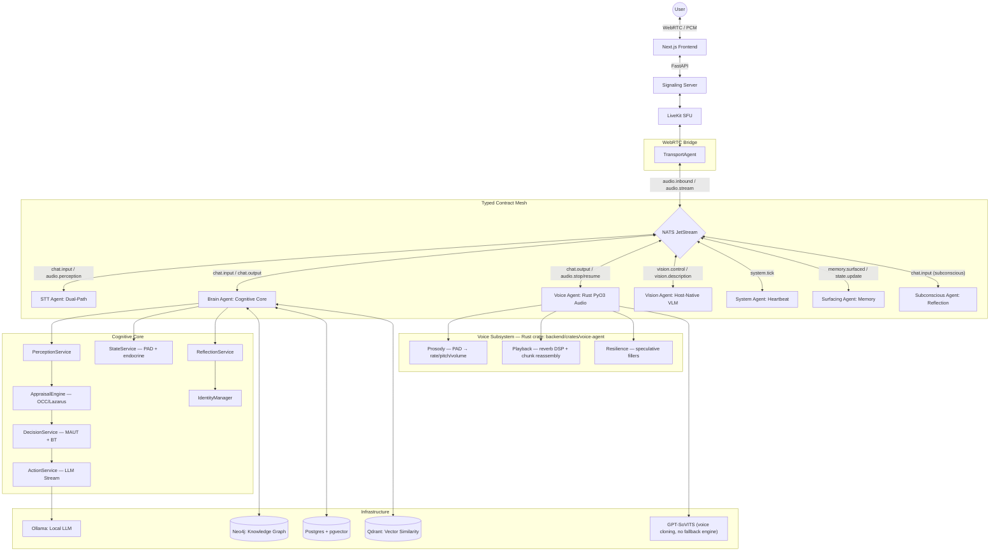

# AI Friend

**An AI friend you describe in your own words, that speaks in a voice you gave it, runs entirely on your own machine, and remembers who you are.**

[](https://opensource.org/license/MIT)
[](<https://colab.research.google.com/github/PALabs-v1/AI_friend/blob/main/notebooks/ai_friend_voice_training.ipynb>)
[](<https://github.com/PALabs-v1/AI_friend/actions/workflows/ci.yml>)
[](<https://github.com/PALabs-v1/AI_friend/actions/workflows/mesh-integrity.yml>)
[](<https://github.com/PALabs-v1/AI_friend/actions/workflows/cognitive-regression.yml>)
[](<https://github.com/PALabs-v1/AI_friend/actions/workflows/persona-guard.yml>)
[](<https://github.com/PALabs-v1/AI_friend/actions/workflows/security-audit.yml>)
[](<https://github.com/PALabs-v1/AI_friend/actions/workflows/docker-build.yml>)
[](<https://github.com/PALabs-v1/AI_friend/actions/workflows/docker-health.yml>)

<p align="center">
  
</p>

---

## What this is

Most "AI companion" products are a character picker in front of a shared cloud
model. This is the opposite bet: **one friend, described by you, that lives
entirely on your own hardware.** The novelty here is the **Brain** — a
persistent cognitive/affect/memory architecture (see `ARCHITECTURE.md`) that
gives the agent continuity a stateless prompt can't. Voice and vision are
supporting modalities the Brain drives, not separate pillars.

- **You write who they are, in prose.** No template picker, no slider grid.
  "She's blunt, hates small talk, gets genuinely annoyed when I dodge a
  question, grew up somewhere cold" is a complete persona description. A CLI
  wizard compiles it, shows you what it inferred (including *why*), and lets
  you talk to a dry run before anything is permanent.
- **Full emotional range, including friction with you.** No softening when
  you're distressed, no infinite patience by design. A small, non-negotiable
  safety floor sits underneath — an authored friend can be blunt, but not
  cruel — everything else is yours to write.
- **Its own voice, from the first boot.** Clone a voice from an 8-second clip
  you record (with consent guidance, not a hard gate), or start talking
  immediately with a bundled default while you decide.
- **Local-first.** Ollama, Postgres, Neo4j, Qdrant, NATS — all self-hosted, all
  on your machine. No account, no conversation leaves your hardware unless you
  explicitly opt into a cloud LLM fallback for weaker hardware.
- **Portable.** Export your friend's identity and memory, wipe the machine,
  import it back. It's their memory, not the deployment's.

This is a solo open-source project, built and documented in the open as it's
built. `CLAUDE.md` and `.agents/CONTEXT.md` are the engineering ledger — what
was actually built, what was measured, and what was deliberately left undone.
Where this file and the ledger disagree, **the ledger is right**.

## What makes it different, technically

A few things here aren't the obvious way to build this, and are worth knowing
about before you read the rest:

- **An endocrine layer, not just a mood score.** `cortisol` and `dopamine` are
  each *tonic + phasic* — a slow baseline that's a pure function of current
  affect, plus a decaying burst on top (half-life 90s for reward, 600s for
  stress) fired by real events and decayed by elapsed time, not by a tick.
  Because the two burst channels are independent of the anti-correlated tonic
  terms, the agent can be stressed and rewarded *at the same time* — annoyed
  at you and glad you're there. These hormones aren't decorative: cortisol
  narrows LLM sampling temperature, dopamine widens `top_p`, fatigue shortens
  the response length. Mood measurably changes how the model generates, not
  just what persona text gets prepended.
- **A persona with an enforced boundary, not a convention.** Every persona
  field is sorted into one of three tiers, declared in the schema so the
  boundary is checked in code rather than assumed: **IMMUTABLE** (a small
  hard-coded safety floor no authored persona can touch), **CONSTITUTIONAL**
  (temperament, fixed at creation — half-lives, drift rates, baselines),
  **ADAPTIVE** (seeded by you, then owned and slowly evolved by the agent
  itself, capped at 5 traits). A persona file naming an immutable field is
  rejected outright rather than silently accepted.
- **A learned mental lexicon, not a hardcoded thesaurus.** Memory retrieval
  expands query cues through associations the agent has actually built from
  its own conversations (`lexicon_store.py`) — the generic English seed exists
  only to bootstrap a brand-new agent's database and is never touched again
  once real conversation exists.
- **Timing is physically synthesized, not scripted.** Pauses, barge-in
  ducking, and prosody shifts are rendered as real PCM sample manipulation in
  a Rust voice pipeline (sample-accurate chunk reassembly, a comb-filter
  reverb blend by user distance) — not text markers a model was asked to
  insert.

None of this is marketed as state-of-the-art against commercial systems — see
`.agents/CONTEXT.md` for what's actually been measured, what's estimated, and
what's still an open target.

## Quick start

You need [Docker](https://docs.docker.com/get-docker/) and
[Ollama](https://ollama.com) (`ollama serve` running, host-native — not
containerized by default) on a machine with at least ~16GB RAM. A GPU is
optional: a 3B-class Ollama model runs on CPU, and real-time voice cloning
(GPT-SoVITS) is meaningfully faster with one but not required to boot.

```bash
git clone https://github.com/PALabs-v1/AI_friend.git
cd AI_friend
cp .env.example .env   # fill in the secrets it asks for
./start.sh              # or: make start
```

`start.sh` (roadmap Phase 1.6) does the whole boot sequence itself and refuses
to half-start: creates the shared Docker network, confirms Ollama is reachable
and pulls the required models, ships a bundled default voice so the agent can
speak before you've recorded your own, brings up Postgres/Neo4j/Redis/NATS/
LiveKit, waits for Postgres to actually be healthy before pushing the Prisma
schema, then starts the right container set for your chosen mode:

```bash
./start.sh light             # cognitive-only: no real-time voice/STT
./start.sh heavy             # cognitive + local Whisper STT, no voice cloning
./start.sh full               # the default: everything, including voice cloning
./start.sh full --vision      # + the vision agent (Linux host only, see below)
```

### Create your friend

Once the mesh is up:

```bash
cd backend
../.venv/bin/python -m scripts.create_friend      # macOS/Linux
../.venv/Scripts/python.exe -m scripts.create_friend  # Windows
```

Describe your friend in your own words. The wizard compiles that description
into a persona, shows you exactly what it inferred — every numeric
temperament choice with its reasoning — and lets you try a dry-run
conversation before anything is committed. Persona seeding is a one-way door
(it applies once, on first boot, and never again), so everything before you
confirm is free to redo; nothing after is. Your persona lives in the fully
gitignored `personal/` directory, never in a tracked file.

No mic handy, or want to iterate on the persona in text first? `scripts/talk.py`
is a REPL against the same cognitive pipeline the voice path uses, with no
LiveKit/STT/TTS required.

## Architecture

Agents are separate processes coordinated over **NATS JetStream**, not
function calls — a decoupled signal-bus mesh, not a monolith with internal
method calls.



Full deep-dive: see the Architecture section in [`CLAUDE.md`](CLAUDE.md).

### Agents

| Agent | Technology | Role | NATS Subjects |
| :--- | :--- | :--- | :--- |
| **Signaling** | Python / FastAPI | LiveKit token issuance; the frontend's REST entry point (`main.py`). Not a NATS agent. | *(none — REST only)* |
| **Brain Agent** | Python / Ollama | Cognitive core; appraisal, decision, action, state. | `chat.*`, `state.*`, `knowledge.*` |
| **Voice Agent** | Rust / GPT-SoVITS | Renders affect-aware 32kHz audio through one cloned-voice engine, no fallback to a different voice. | `chat.output`, `audio.stream`, `audio.stop` |
| **STT Agent** | Rust / whisper.cpp + sherpa-onnx | Dual-path: whisper.cpp for the final transcript, SenseVoice for a fast speculative path with speech-emotion classification (falls back to a small Whisper model — words, no tone — when SenseVoice isn't provisioned). | `audio.inbound`, `chat.input`, `audio.perception` |
| **Transport Agent** | Python / LiveKit | WebRTC gateway; raw PCM chunking and stream bridging. | `audio.inbound`, `audio.stream` |
| **Surfacing Agent** | Python / pgvector | ACT-R-style episodic memory retrieval and proactive recall. | `memory.surfaced`, `chat.input` |
| **Subconscious** | Python / Neo4j | Background reflection, internal monologue, proactive outreach. | `chat.input`, `system.tick`, `knowledge.*` |
| **Vision Agent** ⚠️ | Ollama / moondream | Host-native visual appraisal. **Opt-in** (`profiles: [vision]`); must run natively on Windows/macOS since Docker Desktop's Linux VM has no route to the host display/camera — works containerized on Linux only. | `vision.frames`, `vision.control`, `vision.description` |
| **Pulse Agent** | Python / asyncio | Mesh heartbeat (`SYSTEM_TICK_INTERVAL`, default 60s). | `system.tick` |

### The cognitive turn

1. **Perception** — Transport Agent publishes raw PCM to `audio.inbound`.
2. **Speculation** — STT Agent's fast path identifies high-confidence intent and any classified emotion.
3. **Reflex** — Voice Agent immediately soft-attenuates on a speculative interruption signal.
4. **Appraisal** — Brain Agent computes emotional valence (OCC/Lazarus-inspired) and updates PAD + endocrine state.
5. **Deliberation** — Decision Service scores candidate intents (Multi-Attribute Utility Theory).
6. **Synthesis** — Voice Agent renders the response using the current affect vector, with timing markers parsed inline.
7. **Closure** — Voice Agent reports playback telemetry back to the Brain for the next turn's pacing.

### Core cognitive models

- **Affect (PAD).** A 3D coordinate (Pleasure, Arousal, Dominance). Events pull
  the state toward target coordinates; idle periods drift it back toward
  baseline on a logarithmic decay.
- **Memory gating.** Semantic search score incorporates emotional bias:
  `S = cos_sim · (1 + 0.1·valence·emotional_weight − 0.2·arousal·cortisol)` —
  positive memories are reinforced, high-stress memories are suppressed during
  hyper-arousal to avoid trauma-loop retrieval.
- **ACT-R-style decay.** `A = ln(recall_count) − d·ln(hours_since_created + 1)`;
  memories below the retention threshold are pruned from the active set (moved
  to an archive tier, not deleted, and can be promoted back).
- **Trust (Marsh model).** Trust is three sub-dimensions — Benevolence,
  Competence, Integrity — each updated independently by appraisal, rather than
  one scalar.
- **Endocrine → sampling.** `temperature = 0.9 − 0.6·cortisol`,
  `top_p = 0.70 + 0.25·dopamine`, `num_predict` shortened by fatigue (bounded
  15–40 tokens for filler-scale generations).
- **Decision utility (MAUT).** Candidate intents are scored as a weighted sum
  of goal alignment, emotional fit, identity fit, and context relevance.
- **Prosody.** Speaking rate, pitch, volume, and pause bias are continuous
  functions of PAD state, fatigue, and estimated user distance, computed in
  Rust and applied at clean chunk boundaries — an earlier cross-fade at
  prosody-shift boundaries was removed after it re-played audio the listener
  had already heard.

## Voice

- **Single-engine synthesis.** All speech renders through one self-hosted
  GPT-SoVITS endpoint carrying the cloned voice's identity in its trained
  weights — there is deliberately no fallback to a *different, uncloned*
  voice; a confirmed synthesis failure plays a same-voice fallback
  vocalization rather than switching identities.
- **Emotion-selected reference clips.** Delivery register (calm/warm/
  concerned/excited/neutral) is chosen per turn from the agent's own affect
  state and passed as SoVITS's reference clip — steering delivery, not
  identity, which stays baked into the loaded model weights.
- **Speculative fillers.** If decision latency exceeds 1200ms, an early filler
  (hmm, let's see) keeps the conversation alive while the real audio renders.
- **Voice training.** GPT-SoVITS fine-tuning on your own recordings is heavy
  GPU work — see [`notebooks/`](notebooks/) for Colab notebooks covering
  voice training, the behavioral eval harness, and raw LLM throughput
  benchmarking:

| Task | Notebook | 1-Click Launch | Purpose |
| :--- | :--- | :---: | :--- |
| **Voice Cloning** | `ai_friend_voice_training.ipynb` | <a href="https://colab.research.google.com/github/PALabs-v1/AI_friend/blob/main/notebooks/ai_friend_voice_training.ipynb" target="_parent"></a> | Fine-tune custom GPT-SoVITS voice weights from audio |
| **Behavioral Evals** | `ai_friend_eval_harness.ipynb` | <a href="https://colab.research.google.com/github/PALabs-v1/AI_friend/blob/main/notebooks/ai_friend_eval_harness.ipynb" target="_parent"></a> | Test persona defense & 240-turn memory retention |
| **LLM Benchmark** | `ai_friend_llm_benchmark.ipynb` | <a href="https://colab.research.google.com/github/PALabs-v1/AI_friend/blob/main/notebooks/ai_friend_llm_benchmark.ipynb" target="_parent"></a> | Measure raw TTFT and tokens/sec on GPU |

## Signal bus contracts

Every subject has a Pydantic schema in `backend/app/contracts.py`.

| Subject | Payload Model | Purpose |
| :--- | :--- | :--- |
| `chat.input` | `ChatInput` | User utterances and manual injections. |
| `chat.output` | `ChatOutput` | Cognitive responses with affect metadata. |
| `audio.perception` | `AudioPerception` | Real-time emotional bias and speculative intent. |
| `audio.stop` | `AudioStop` | Speculative or final interruption commands. |
| `state.update` | `StateUpdate` | Broadcast of PAD/relational coordinate shifts. |
| `memory.surfaced` | `MemorySurfaced` | Proactive episodic or semantic recall triggers. |
| `system.tick` | *(untyped dict)* | Mesh-wide heartbeat, no dedicated model. |
| `user.voice.properties` | `UserVoiceProperties` | Real-time user pitch, energy, and speech-rate telemetry. |
| `agent.voice.modulation` | `AgentVoiceModulation` | Frame-wise prosody trajectory (50ms intervals). |
| `audio.playback.visemes` | `PlaybackVisemes` | Sample-accurate mouth-shape triggers. |
| `audio.playback.progress` | `AudioPlaybackProgress` | Real word/character offset reached, for truncating an interrupted reply at an actual boundary. |
| `ambient.noise.telemetry` | `AmbientNoiseTelemetry` | Endpointer noise-floor readings for barge-in tuning. |

## Directory layout

```text
AI_friend/
├── backend/                # Python + Rust workspace
│   ├── app/                 # agents, cognition, state, persona, vision
│   ├── crates/               # contracts, cognitive-rust, stt-agent, voice-agent
│   ├── tests/                 # pytest suite
│   ├── evals/                  # behavioral eval harness (LLM boundary probes)
│   ├── scripts/                 # create_friend, talk, export/import, bootstrap
│   ├── tools/                    # measure/ (live-infra harness), quality/ (lint baselines)
│   └── db/                        # schema.sql (source of truth), migrations
├── frontend/                # Next.js web app (chat, onboarding, memory browser)
├── website/                  # Design-system donor + future public landing page
├── docs/                       # Architecture deep-dive, operational guides
├── notebooks/                    # Colab: voice training, eval harness, LLM benchmarking
├── config/                         # Neutral example persona.toml / biography.md
├── personal/                        # Your real persona (gitignored, never tracked)
├── .agents/CONTEXT.md                # The engineering ledger — ground truth
├── start.sh                           # One-command start (Phase 1.6)
├── docker-compose.infra.yml            # Postgres, Neo4j, Redis, NATS, LiveKit, Qdrant, Ollama (opt-in)
├── docker-compose.prod.yml              # Agent mesh + frontend
├── docker-compose.light.yml              # Cognitive-only overlay
└── docker-compose.heavy.yml               # Cognitive + local STT overlay, no voice cloning
```

## Hardware

There is no packaged install yet (that's a stated future goal, not a current
claim) — you run it from source via Docker Compose.

- **Minimum**: a machine that can run Docker Compose and a ~3B-parameter
  Ollama model on CPU — this project's own development has run on a 16GB
  unified-memory MacBook. Voice cloning (GPT-SoVITS) and Whisper STT are
  noticeably slower without a GPU but not blocked by its absence — `light`
  mode skips them entirely.
- **A GPU** (local or rented) speeds up real-time voice cloning and STT, and
  is effectively required for GPT-SoVITS *fine-tuning* on your own voice
  recordings — see the Colab notebooks for that path rather than doing it on
  a laptop.
- **Larger local models**: While 3B models (`llama3.2:3b`) provide a lightweight
  CPU baseline, empirical testing on Cloud GPU demonstrates that **Hermes 3 (8B)**
  (`hermes3:8b`) delivers **61.9 ms TTFT** and **46.6 tokens/sec** with unwavering
  persona consistency (`persona.rename-resistance = 1.00`) and prompt disclosure defense,
  while **Qwen 2.5 (14B)** provides **0.750 memory retention** across 240 dialogue turns.
  An optional cloud LLM fallback (`LLM_PROVIDER=anthropic`) remains available for low-spec hosts.
  These specific figures are from one benchmark corpus
  (`_archive/research/hard_benchmark.py`, `.agents/CONTEXT.md` 2026-07-18) and
  describe that run, not a guarantee for
  every deployment — production personas here are authored per-install with
  no shared reference corpus, so a fresh figure can't be computed against an
  arbitrary running instance.

## What's proven, what's a target

This project tries hard not to overstate itself. `.agents/CONTEXT.md` is the
full, dated record of what was built, what was actually measured against real
infrastructure, and what's still an open target — read it before trusting a
specific number anywhere else in this repo, including in `docs/`. A few
standing rules that keep it honest:

- Placeholder/unmeasured figures are marked `[TBP]` or "not yet measured,"
  never presented as a result.
- The behavioral eval harness (`backend/evals/`) scores deterministically —
  never an LLM judge — and every report is checked for `provenance=live`
  before being trusted, because a silently-mocked run produces a passing
  score that means nothing.
- `backend/tools/measure/` is the live-infrastructure measurement harness
  behind any latency/memory/throughput number in the ledger. Its own `evals`/
  `measure` smoke checks run in CI (`integration-harness.yml`) so the
  harnesses themselves don't quietly rot even between measurement runs.

## Configuration reference

Grouped by domain — see `backend/app/config.py` for the full set.

### Infrastructure

| Parameter | Default | Purpose |
| :--- | :--- | :--- |
| `NATS_URL` | `nats://127.0.0.1:4222` | Signal bus endpoint. |
| `NEO4J_URI` | `bolt://127.0.0.1:7687` | Knowledge graph endpoint. |
| `DATABASE_URL` | `postgresql://...` | Identity and memory state store. |

### Cognition & affect

| Parameter | Default | Purpose |
| :--- | :--- | :--- |
| `SYSTEM_TICK_INTERVAL` | `60s` | Mesh heartbeat frequency. |
| `PSYCH_ALPHA` | `0.3` | Valence drift rate toward target. |
| `ACTR_DECAY_RATE` | `0.5` | Forgetting rate for episodic memory. |

## Troubleshooting

**Port conflicts (5432/5433 already in use).** A native Postgres install on
your host will block the container's port binding:

```bash
brew services stop postgresql        # macOS
sudo systemctl stop postgresql       # Linux
```

**Mesh communication silence.**

```bash
docker exec -it nats_mesh nats stream info AI_MESSAGES
```

**Stale emotional state.** Verify Neo4j TTL cache invalidation:

```bash
cd backend && ../.venv/bin/python -m pytest tests/test_regressions.py::test_state_hydration_avoids_stale_cache
```

**WSL2 disk bloat (Windows).** The virtual disk (`ext4.vhdx`) never shrinks
automatically — empty the Recycle Bin (WSL deletions land there first) and
run `wsl --shutdown` to let Windows reclaim the space.

## Research instrumentation

For controlled experiments, `scripts/research/` has real-time signal mesh
latency profiling (`monitor.py`), a high-frequency PAD trajectory logger
(`collector.py`), standardized pulse injection to eliminate human timing noise
(`injector.py`), and publication-style plotting (`visualizer.py`).

## Glossary

- **BDI** — Belief-Desire-Intention cognitive framework.
- **PAD** — Pleasure, Arousal, Dominance emotional model.
- **MAUT** — Multi-Attribute Utility Theory.
- **OLA** — Overlap-Add signal processing.
- **ACT-R** — Adaptive Control of Thought—Rational.

## Contributing

See [`CONTRIBUTING.md`](CONTRIBUTING.md), [`CODE_OF_CONDUCT.md`](CODE_OF_CONDUCT.md),
and [`SECURITY.md`](SECURITY.md). `CLAUDE.md` is the guide for working in this
codebase specifically — conventions, verification bar, and the CI gotchas that
aren't obvious from the workflow files alone.

Questions, bug reports, and feature ideas go through [`SUPPORT.md`](SUPPORT.md).
[`GOVERNANCE.md`](GOVERNANCE.md) and [`MAINTAINERS.md`](MAINTAINERS.md) cover
who decides what, honestly scoped to a single-maintainer project today. If
you use this in research or a project of your own,
[`CITATION.cff`](CITATION.cff) has the citation metadata.

## License

Distributed under the MIT License. See [`LICENSE`](LICENSE).
