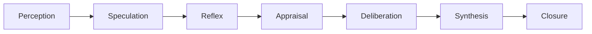

# Architecture of Mind

Every turn runs through a closed cognitive loop, not a single prompt-and-response call. The loop is a BDI (belief-desire-intention) structure: beliefs come from memory and perception, desires are goals arbitrated against context, and intentions are committed actions — speech is one possible action, not the default.

---

## The 7-Stage Cognitive Turn

1. **Perception** — Transport Agent publishes raw signal (audio, text, vision events) onto the mesh.
2. **Speculation** — the fast STT path identifies high-confidence intent before the final transcript is ready.
3. **Reflex** — a startle or barge-in signal can immediately duck audio output, bypassing deliberation entirely (a deterministic, non-LLM reaction — see the Playground's sub-millisecond reflex benchmark).
4. **Appraisal** — the event is scored against active goals, expectation, agency, and relationship impact (OCC/Lazarus-inspired), updating PAD affect and the endocrine state.
5. **Deliberation** — candidate actions are scored with Multi-Attribute Utility Theory (goal alignment, emotional fit, identity fit, context relevance), plus an ACT-R-style reinforcement-learning term that lets the utility of pursuing a given goal shift with observed outcomes over time.
6. **Synthesis** — the selected action is realized (usually speech, but `WAIT`, `RETRIEVE`, `ASK`, and other non-speech actions genuinely compete and can win).
7. **Closure** — the outcome (what was actually said or done, and what happened next) is recorded, closing the loop back into appraisal and learning for the next turn.

## Why Action Selection, Not Just Response Generation

Most conversational systems have exactly one action: generate text. Here, an `ActionCandidate` is scored and selected *before* any language is generated — the LLM's job is to realize an already-chosen action (speak, ask a clarifying question, wait, retrieve a memory, reflect), not to decide what to do. This is what makes principled silence possible: a `WAIT` candidate can win the deliberation stage and produce zero speech output, which a purely generative system structurally cannot do — it always has something to say because generation *is* the decision.

## Metacognition: Knowing What You Don't Know

A separate calibration layer tracks how often past confidence predictions matched actual outcomes (a Brier-scored discount), and maps the result to one of five directives — `PROCEED`, `HEDGE`, `ASK_CLARIFICATION`, `VERIFY`, or `ABSTAIN` — rather than trusting the model's own stated confidence. A known-limitation match short-circuits straight to `ABSTAIN`. See [Theory of Mind & Metacognition](/docs/concepts/theory-of-mind-and-metacognition) for the full mechanism, and try the Playground's Metacognitive Abstention demo — it runs the exact same thresholds client-side.

## What This Is Not

This is an engineering decomposition, not a claim about consciousness, biological cognition, or human-equivalent reasoning. "Fast" and "slow" cognition here means latency tiers with different budgets and model-use policies — not a claim about System 1/System 2 psychology. See [ARCHITECTURE.md](https://github.com/PALabs-v1/AI_friend/blob/main/ARCHITECTURE.md) in the repository root for the full mechanism register, including what's explicitly rejected or deferred.
